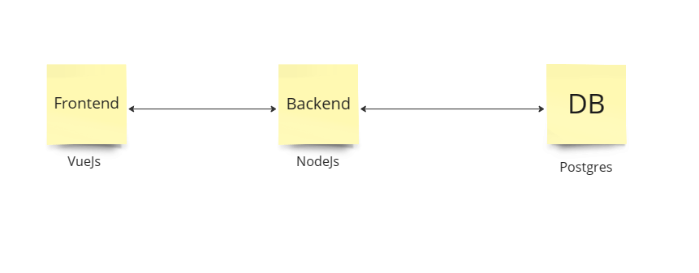

## Pre test

Clone project นี้ลงมาและสร้าง Dockerfile และ docker-compose เพื่อสร้าง containers ตามรูปภาพด้านล่าง

**1. Frontend:** ให้ใช้ Dockerfile ใน folder frontend สร้าง image ขึ้นมาและ ใช้ image run container frontend ด้วย docker-compose

**2. Backend:** ให้ใช้ Dockerfile ใน folder backend สร้าง image ขึ้นมาและ ใช้ image run container backend ด้วย docker-compose

**3. Database:** สร้าง Dockerfile เพื่อ Insert sql script โดยเริ่มจาก file table.sql ต่อด้วย data.sql หลังจากนั้น run container database ด้วย docker-compose